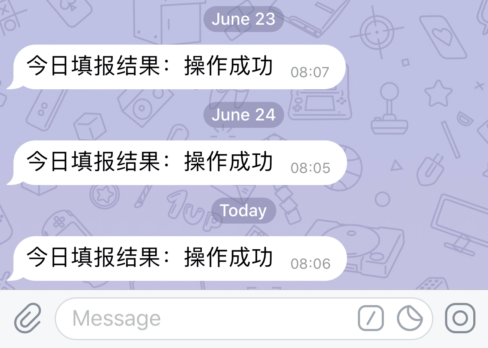
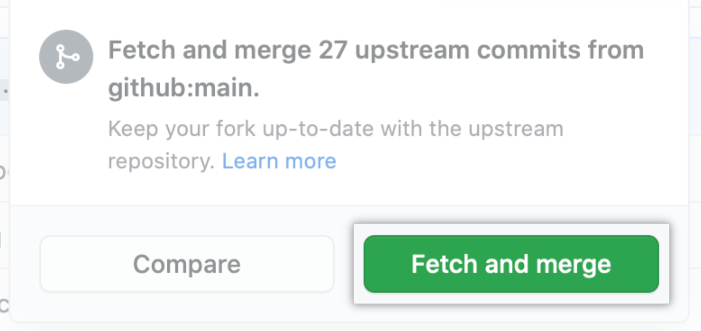

<h1 align="center" style="border-bottom: none">
  bupt-ncov-report-action
</h1>

<p align="center">
  使用 GitHub Actions 自动填报北邮 COVID-19 疫情信息。
</p>

<p align="center">
  <a href="https://github.com/imtsuki/bupt-ncov-report-action"></a>
  <a href="https://github.com/imtsuki/bupt-ncov-report-action"></a>
</p>



这个 Action 会自动在北京时间的每天 8:00 AM 进行填报。

为了防止网络波动造成的失败，会间隔十分钟尝试六次。

支持最新的 OAuth 登录。

## 使用方法

### 方法一（Use this template）

最简单的方法，是点击上方绿色的 **Use this template**，使用这个模板创建你自己的 Repository：

然后，在你自己仓库的 Settings 的 Secrets 中设置以下信息：

- `BUPT_USERNAME`: 你用来登录的学号；
- `BUPT_PASSWORD`: 你用来登录的密码。

这种方法的缺点是无法同步上游的更新。

### 方法二（Fork）

**Use this template** 并不会自动追踪该仓库的后续更新。

第二种方法是，点击右上角的 **Fork** 按钮来创建自己的 Repository。注意在这种情况下，你可能需要在 Settings 中手动开启 GitHub Actions 的运行，因为在 Fork 的仓库中，这个开关会默认关闭。


若需要更新脚本，可以点击页面上方的 **Fetch upstream** 按钮：


然后点击 **Fetch and Merge**：



## 检查结果

无需任何设置。如果运行失败，GitHub 会向你的邮箱发送一封邮件。

如果你更改了设置，想手动重新运行，可以点进上方的 Actions 栏，点击 Re-run Jobs 来重新运行。

### Telegram Bot

如果你知道怎么使用 Telegram Bot，则可以额外设置如下的 Secrets 来用 Bot 给你发送结果：

- `TG_BOT_TOKEN`: 你的 Bot 的 Token；
- `TG_CHAT_ID`: 你和 Bot 的 Chat ID。

### `Timeout awaiting 'request' for 2000ms` 错误

这一般是 GitHub Actions 连接学校服务器过程中网络不稳定导致的。代码中默认以 2000ms 的间隔重试 100 次（见 `src/index.ts`）。这种情况下，你可以手动重试，或更改重试的间隔和次数，或者将该脚本部署到 Gitee 等国内服务上。

### 表单字段更新

有时，填报系统中的表单字段会有更新。由于该脚本会获取前一天的填报内容并提交，在某些情况下可能会出现错误。此时，你需要手动填报一次。如果第二天依然出错，请开 issue。

## 高级设置

你可以在 `.github/workflows/main.yml` 中来设置每天运行的时间：

```yml
on:
  schedule:
    - cron: '0 0 * * *'
```

格式是标准的 cron 格式，第一个数字代表分钟，第二个数字代表小时。例如，`0 1 * * *` 表示在每天
格林尼治时间的 1:00 AM，也就是在北京时间的 9:00 AM 自动运行。
